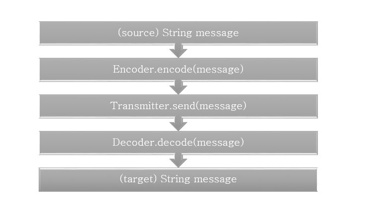

# bitEncoderDecoderCollaboration 

Shared project by: Paweł Dąbrowski, Przemysław Tyczyno and Rafał Pajdak

Multistage coding exercise based on JetBrains Academy project https://hyperskill.org/projects/58?track=1

## What we are learning here
<ul>
<li>working in small group on one project</li>
<li>simple documentation</li>
<li>branching and issue tracking</li>
</ul>

## What is this project actually?
We are building an App which simulates transmition of information via internet.  
There are three modules here:
<ol>
<li><strong>Encoder</strong> - takes an input message and encodes it, using a strategy to prevent information loss on transfer by Transmitter.</li>
<li><strong>Transmitter</strong> - generates random noise in each section of transmitted message.</li>
<li><strong>Decoder</strong> - takes transmitted message and recovers the original input, using loss-prevention strategies</li></ol>

On Stages 1-4 we are working with loss prevention strategies based on symbol (char) level. Stages 5+ will be dedicated for bitwise operations and operation such as bit parity and Hamming code.

 

## Workflow
<ol>
<li>Project is divided into small <strong>Stages</strong>, each has some added value to the final project. Stages are not independent, but they contribute to final stage of project.</li>
<li>Each Stage has some issues, smaller steps to accomplish - at least: tests (we try to follow TDD), documentation and implementation.</li>
<li>Issues are created on Project page in column <strong>To do</strong> and assigned to a developer.</li>
<li>When we start working on issue, we change its status from <strong>To do</strong> to <strong>In progress</strong>.</li>
<li>When the code is done, we change status to <strong>In review</strong> and wait for acceptance of other members.</li>
<li>If code is accepted, merge is done by reviewer. Change issue status to <strong>Done</strong></li>
<li>if code is not accepted, add comments and change status to <strong>In progress</strong></li>
</ol>

## Branching instruction
<ul><li>Each branch is named for issue number and short label, describing feature. If there is no issue connected to your task - create one.</li>
<li>We are pulling our code to <strong>dev</strong> branch.</li>
<li>After completing new stage, there is a release pull from <strong>dev</strong> to <strong>main</strong>.</li></ul>

Example name of branch:

> 40-newBranchesDescription

## Stage 1
Introduction - create a method encode() in class Stage1. Method takes a string as an input and return another string with tripled each character.

> For example:
>
> abc -> aaabbbccc
>
> test -> ttteeesssttt

## Stage 2
Create a method send() in class Stage2. Method takes a string (it should be each character repeat 3 times, for example 
instead of d - ddd) as an input and return another string, with changed one char of each of 3 chars blocks.
>For example
>
>aaabbbccc -> axabtbcoc
>
>sssooosss -> ssqsoooss

## Stage 3
Create a method decode() in class Stage3. Method takes a string (as output from Stage2.send()) and tries to recover original message. Strategy is to check each section of 3 chars, because only one char per 3 is corrupted.

>For example:
>
>aaP -> a
>
>TToE_E!SSttO -> TESt

## Stage 4
Connect actions from Stages 1-3 to App class. Use interfaces as described below:

> Encoder: String encode(String)
>
> Transmitter: String send(String)
>
> Decoder: String decode()

Interface implementantation comes from Stages1-3, but we will switch them on later Stages.

## Stage 5
Implement Encoder on bitwise level. We will work on every char of String message.
Please remember, that Strings are char arrays, and chars are just numbers "casted" on ASCII table values (it is a simplification but for this project should be sufficient).
 We will manipulate every char (number) in String input. For consistency we count bits from left. Every bit of message is divided on smaller parts, like this:
> Here is sample byte of information (input):
> 
> 01011010  (bits are symbolized below by letters:  abcdefgh)
>
> Take 3 first bits (from left) and add 1 parity bit for verification.
>
Parity bits (on positions 7-8 from left) are loss-prevention strategy. We calculate them by adding 3 significant bits:
> 010 - odd (parity bit = 1)
>
> 000 - even (parity bit = 0)
>
> 110 - even (parity bit = 0)
>
> 111 - odd (parity bit = 1)

> After this, you have 3 bits from input + 1 parity bit: abcX
> 
> Double all bits to form first byte of output:
> 
> aabbccXX
> 
> Then take next three bits from input and transfer them in similar way:
> 
> ddeeffXX
>
> And at last, the remaining bits. If there are less than 3 bits remaining, use 0 to fill blanks.
> 
> gghh00XX
>
> Your input was one byte (01011010) but output is three bytes (00110011 11110000 11000011).
